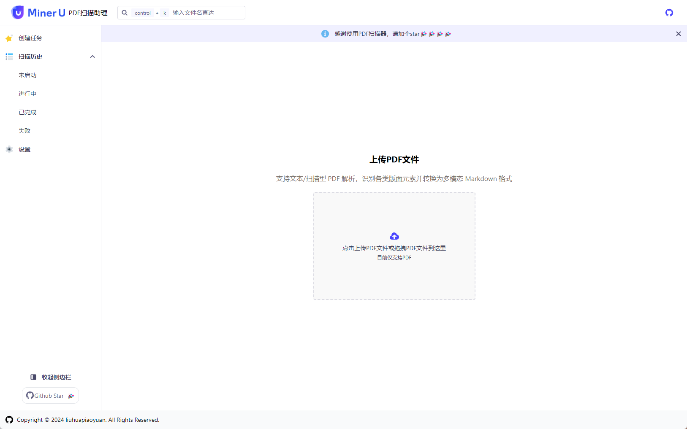
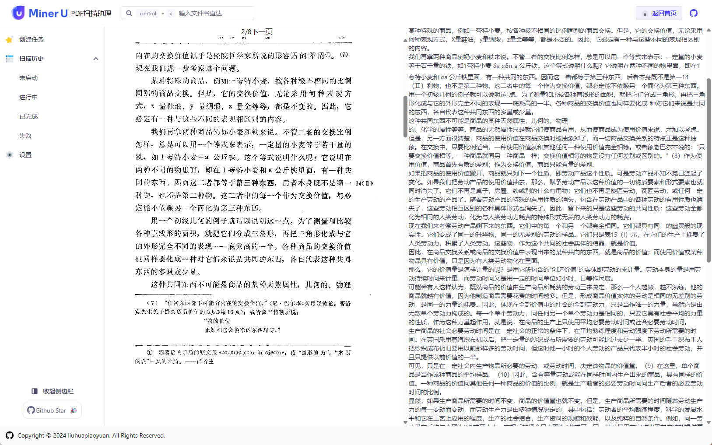
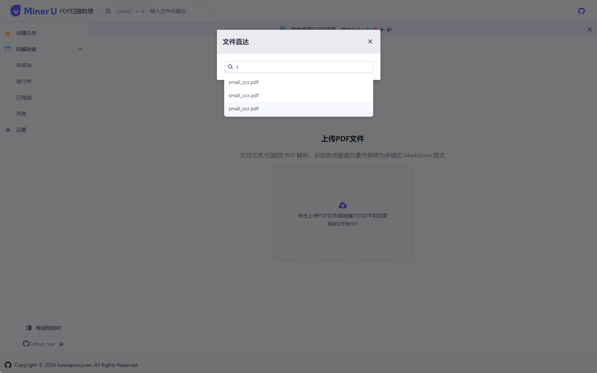

# MinerUPdfScanner

MinerUPdfScanner 是一款基于 [MinerU](https://github.com/opendatalab/MinerU) 的 Windows 客户端程序，用于高效地扫描和提取 PDF 文档中的内容。该工具结合深度学习技术，能够自动提取文档中的文字、表格、图片和公式等，并提供多种分析和统计功能。

## 功能

1. **创建提取任务**
   - 用户可以选择 PDF 文件并提交提取任务。

2. **提取记录查看**
   - 支持按照不同状态查看提取记录，便于管理和跟踪任务进度。

3. **导出提取结果**
   - 用户可以将提取后的结果导出为 ZIP 文件，方便存储和分享。

4. **查看提取结果**
   - 提供左右分栏模式查看提取结果，左侧为 PDF 文档，右侧为 Markdown 格式的提取结果。

## 安装

1. 从 [发行页面](https://github.com/your-repo-link/releases) 下载最新的安装包。
2. 双击安装包并按照提示完成安装。

## 使用方法

1. 启动 MinerUPdfScanner。
2. 点击“创建任务”，选择要提取的 PDF 文件。
3. 提交任务后，可以在“提取记录”中查看任务状态。
4. 提取完成后，可以导出结果或在右侧查看提取内容。

## 图片展示

### 版本发布计划

#### 1.0.0 版本
**发布日期**：预计日期

**功能**：
- 创建提取任务：用户可以选择 PDF 文件并提交提取任务。
- 提取记录查看：支持按照不同状态查看提取记录。
- 导出提取结果：将提取后的结果导出为 ZIP 文件。
- 查看提取结果：提供左右分栏模式查看提取结果，左侧为 PDF 文档，右侧为 Markdown 格式的提取结果。

#### 1.1.0 版本
**发布日期**：预计日期

**功能**：
- 内置完整的 MinerU 运行环境：不再通过外部服务来调用，提升用户体验。
- 支持按照目录批量读取：用户可以一次性选择一个目录，批量处理该目录下的所有 PDF 文件。
- 支持单文件配置保存路径：用户可以配置保存提取结果的路径，提升灵活性。
 

## 技术支持

如有问题或建议，请在 [Issues 页面](https://github.com/your-repo-link/issues) 提出。

## 贡献

欢迎贡献代码！请阅读 [贡献指南](CONTRIBUTING.md) 以了解更多信息。

## License

本项目遵循 MIT 许可证，详细信息请见 [LICENSE](LICENSE) 文件。
