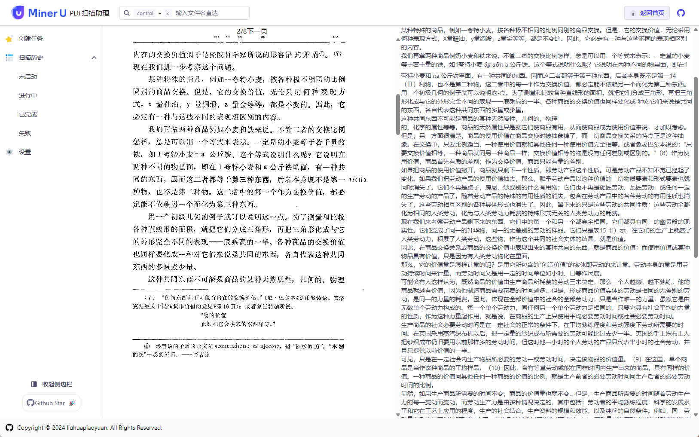
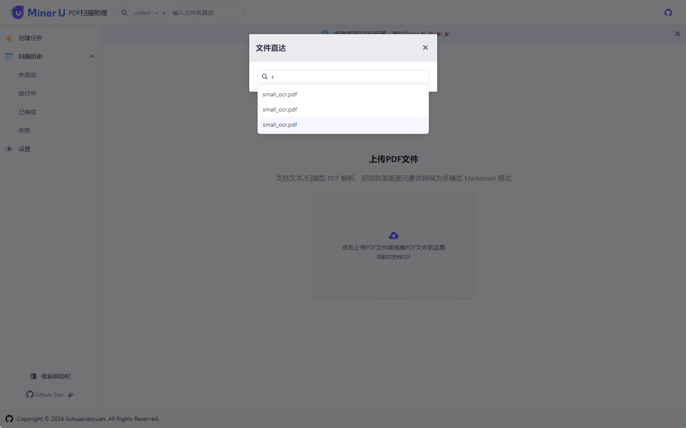
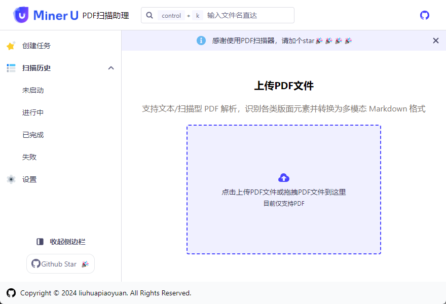

---
# https://brenoepics.github.io/vitepress-carbon/guide/home-component.html
layout: home
hero:
  name: "MinerU-PDFScanner"
  text: "高效 PDF 文档扫描和提取工具"
  tagline: "利用深度学习技术自动提取文档内容，可以识别表格，图片，段落，文本"
  icon: 
    src: ./logo.png
    alt: VitePress Carbon
  image:
    src: ./task.png
    alt: Banner
  actions:
    - theme: brand
      text: Github
      link: https://github.com/liuhuapiaoyuan/MinerU-PDFScanner
    - theme: alt
      text: 下载
      link: https://github.com/liuhuapiaoyuan/MinerU-PDFScanner/releases/latest

features:
  - icon: 
        src: ./logo.png
        alt: VitePress Carbon
    title: 基于MinerU
    details: 支持多页PDF，混合OCR、表格识别、公式识别、段落识别。
  - icon: 📄
    title: 创建提取任务
    details: 用户可以选择 PDF 文件并提交提取任务，轻松开始内容提取。
  - icon: 📋
    title: 提取记录查看
    details: 支持按照不同状态查看提取记录，便于管理和跟踪任务进度。
  - icon: 💾
    title: 导出提取结果
    details: 用户可以将提取后的结果导出为 ZIP 文件，方便存储和分享。
  - icon: 👁️
    title: 查看提取结果左右分栏
    details: 提供模式查看提取结果，左侧为 PDF 文档，右侧为 Markdown 格式的提取结果。
  - icon: 📦    
    title: 打包导出
    details: 通过 ZIP 导出提取结果，包含提取的图片，便于后续使用。

---

